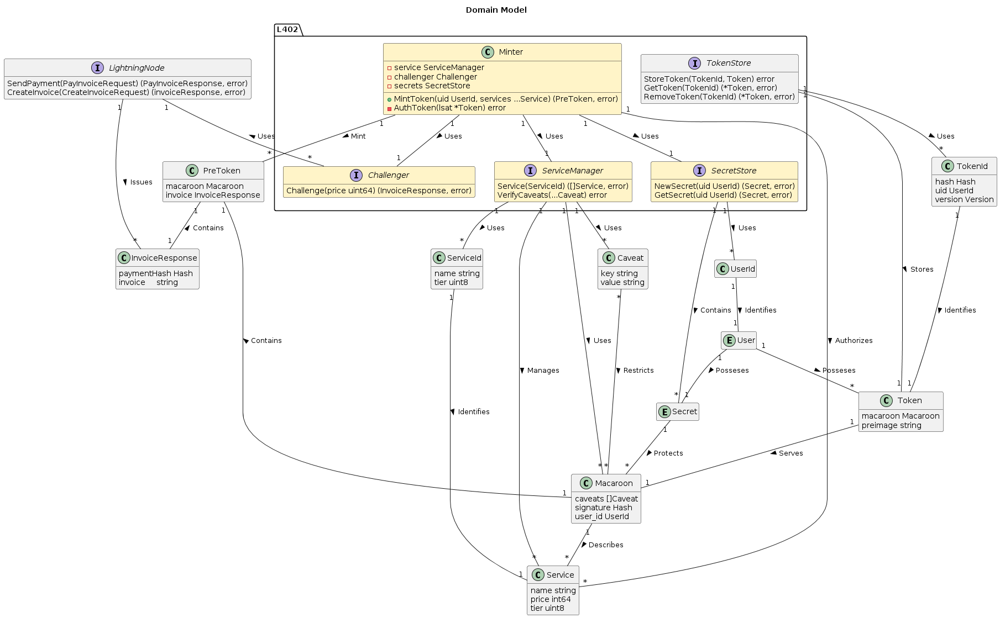
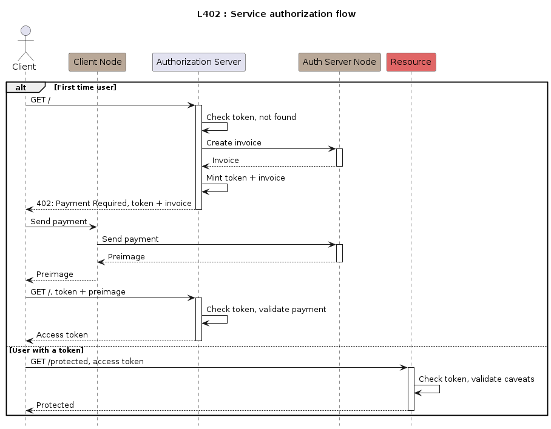

# L402

An implementation of the [L402](https://docs.lightning.engineering/the-lightning-network/l402) protocol.

## Usage

This project doesn't provide yet a standalone [server]() or [client](). However it does provide the basic utilities to:

* Mint L402 tokens
* Verify caveats
* Define services
* Apply restrictions to macaroons

It also provides an implementation of the [phoenixd](https://phoenix.acinq.co/server) API if you want to use it with a real node.

### Example

An example is avaible in `./server/` and `./client/`.

> It uses a mocked lightning node to issue and resolve the challenge.

To get started follow these instructions:

1. **Launch the server**

```sh
# Launch the server
go run ./server/main.go
# 2024/06/09 09:21:20 Server launched at localhost:8080
```

2. **Mint a token and access the service.**

```sh
go run ./client/main.go
# Requesting Token...
# {"user_id":"...","caveats": "...","signature":"..."}
# Sending Authorization Request...
# ...
```

## Model



## Authorization



## Resources

- https://lightning.engineering/api-docs/api/lnd/
- https://docs.lightning.engineering/the-lightning-network/l402
- https://docs.lightning.engineering/the-lightning-network/multihop-payments