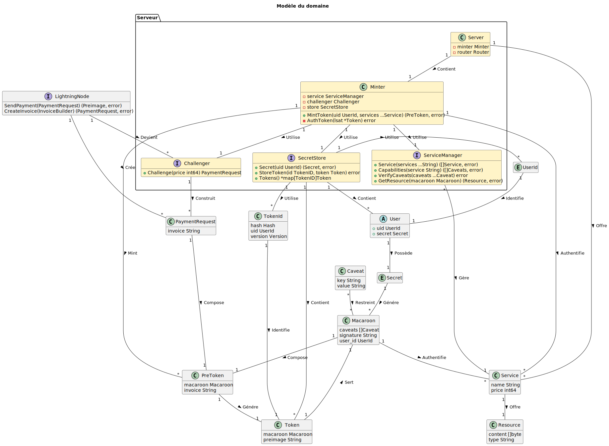
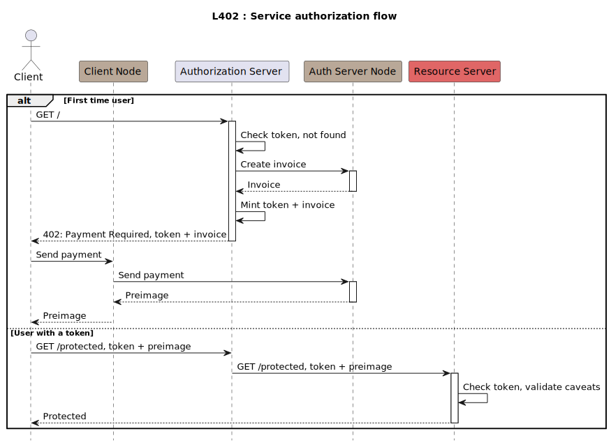

# L402

Une implementation prototype d'un serveur d'authentification [L402](https://docs.lightning.engineering/the-lightning-network/l402).

## Modèle

## Authorization

## Ressources

- https://lightning.engineering/api-docs/api/lnd/
- https://docs.lightning.engineering/the-lightning-network/l402
- https://docs.lightning.engineering/the-lightning-network/multihop-payments